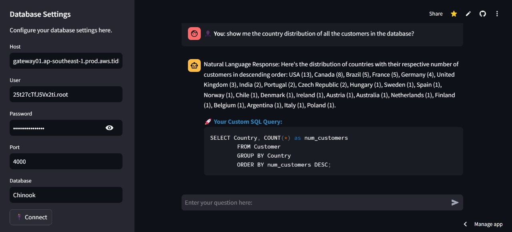
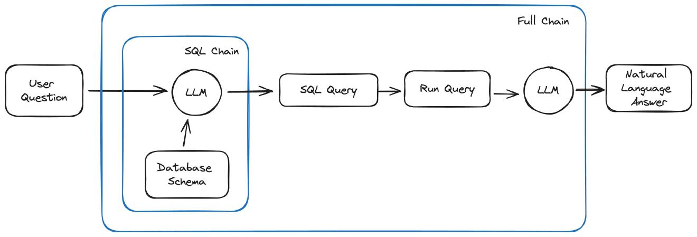
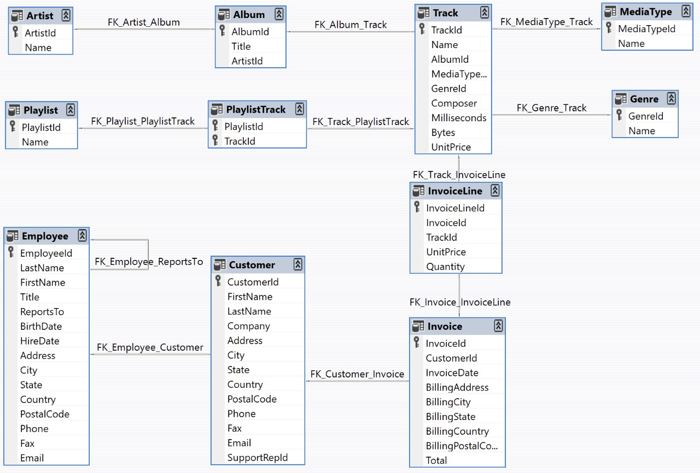

# QueryBot

**QueryBot** is a cutting-edge generative AI chatbot built using **LangChain** and **Mistral AI**, designed to translate natural language into SQL queries seamlessly. It empowers users, even those with no prior knowledge of SQL databases, to interact with and retrieve data effortlessly. Leveraging LangChain’s integration capabilities and Mistral AI’s high-performance models, it ensures efficient, secure database interaction in both local and production environments.

---
## 🌐 Explore QueryBot Live

Check out the live version of QueryBot:  
👉 **[QueryBot Live Website](https://querybot-sql-db-chatbot.streamlit.app/)**

Experience QueryBot's seamless natural language to SQL query transformation directly in your browser!

---

## 🖼️ QueryBot in Action

### User Interface
Here is a screenshot of QueryBot's intuitive interface, where users can type natural language queries and get SQL outputs instantly:


### Example Query and Response
Below is an example of how QueryBot processes a natural language query and provides an SQL query in response:



## 🌟 **Key Features**

  1. **Innovative LangChain Integration:**
     - **Automated Query Generation:** LangChain automates the process of generating SQL queries from user input, allowing non-technical users to interact with the database in natural language.
     - **RAG Pipeline Integration:** LangChain integrates Retrieval-Augmented Generation (RAG) by combining SQL query generation with natural language generation models, ensuring accurate, context-aware responses.

2. **AI-Powered by Mistral AI:**
   - Powered by **Mistral AI**, a state-of-the-art language model from 2024 known for its impactful advancements in generative AI.
   - Mistral AI enhances QueryBot's ability to understand natural language inputs and generate accurate SQL queries.

3. **Real-time Query Execution:**
   - **Dynamic Query Execution:** Executes SQL queries based on user input in real-time, offering immediate results and seamless interaction with the database.
   - **Context-Aware Responses:** Generates responses based on the user's question and conversation history, providing contextually relevant answers.

4. **End-to-End Query Flow:**
   - Converts **natural language inputs** into SQL queries.
   - Executes the queries on integrated databases and retrieves the requested data.
   - Presents results in natural language and showcases the generated SQL query for transparency.

5. **Cross-Database Compatibility**:
   - Easily integrates with multiple databases, including MySQL, PostgreSQL, SQLite, and more.

6. **Effortless Local and Production Setup:**
   - Works seamlessly both locally and in deployed environments.

## 🏗️ **Chain Structure Visualization**

QueryBot leverages two distinct chains to handle natural language queries and translate them into SQL queries for database interaction:

1. **SQL Chain**:
   - The **SQL Chain** is responsible for generating SQL queries based on the table schema and the user’s requirements.
   - It takes the natural language input and translates it into a structured SQL query that can be executed on the database.
   - This chain uses LangChain’s SQLDatabase module to interact with the database schema, ensuring that queries are accurately generated according to the user’s needs.

2. **Full Chain**:
   - The **Full Chain** encompasses the entire flow from the user’s query to the final natural language response.
   - First, it processes the user input and generates a SQL query via the **SQL Chain**.
   - The query is executed against the connected database to retrieve the required data.
   - Once the data is fetched, the result is passed through a large language model (LLM) to generate a human-readable response in natural language, making it easy for non-technical users to understand.

Below is a visualization of how these chains work together to provide seamless interaction with the database and generate context-aware responses:



This diagram shows how the two chains interact to process user queries, ensuring both accurate SQL query generation and the natural language response that follows.

## 🛠 **Project Structure**

### **File Organization**

```plaintext
QueryBot/
├── .devcontainer/            # Development container setup files
├── certs/                    # SSL certificates for secure database connections
│   ├── isrgrootx1.pem
├── database/                 # Database schema and sample data
│   ├── Chinook_MySql.sql     # Sample MySQL database schema
├── app.py                    # Main application file
├── main.ipynb                # Jupyter notebook for development and testing
├── requirements.txt          # Python dependencies
└── README.md                 # Project documentation
```
---
### **Core Components**
- **app.py**:
  - Implements the LangChain-powered SQLDatabase wrapper for seamless querying.
  - Fetches environment variables securely for local development and production setups.
- **certs/**:
  - Stores SSL certificates for secure communication with databases.
- **database/**:
  - Contains sample schemas to help you get started with testing.
- **main.ipynb**:
  - A notebook for experimenting with chatbot features and debugging.
- **requirements.txt**:
  - Lists Python dependencies for the project, including langchain and streamlit.
---
## 🚀 *How It Works*

1. **Setup Database Settings**:
   - Automatically loads database credentials from .env for local development.
   - Loads and integrates database credentials dynamically during runtime from the website settings.

2. **Natural Language Querying**:
   - Input your query in plain English (e.g., "What are the top 5 Artists with the highest number of tracks?").

3. **SQL Query Generation**:
   - LangChain analyzes the query and uses the **sql_chain** function to generate a valid SQL statement.

4. **Execution and Result Retrieval**:
   - The generated SQL query is executed, fetching results from the connected database.
   - QueryBot returns the results in **natural language** along with the SQL query for transparency.

5. **Scalability**:
   - Supports a wide range of databases and works efficiently regardless of data type.
     
---
## 📊 **Why LangChain and Mistral AI?**

### **LangChain**
- **LangChain** is the backbone of QueryBot’s natural language understanding and SQL query generation.
- It simplifies the development process by combining AI tools and utilities into a cohesive framework.
- LangChain’s SQLDatabase and PromptTemplate modules ensure robust and accurate SQL query formation.

### **Mistral AI**
- Mistral AI, a groundbreaking language model launched in 2024, offers unmatched generative AI capabilities.
- It has significantly advanced natural language processing by providing contextually rich and precise responses.
- With its ability to interpret user intent effectively, Mistral AI powers QueryBot’s natural language to SQL pipeline.

---
## Database Structure

The project utilizes a relational SQL database to store and manage data. Below is an Entity-Relationship Diagram (ERD) representing the structure of the SQL database used for this project:



### Description

- **Artist and Album**: The `Artist` table stores artist information, while the `Album` table stores album details associated with the artist.
- **Track Details**: Tracks are stored in the `Track` table, which contains metadata such as media type, genre, and pricing information.
- **Playlist Management**: The `Playlist` table contains playlists, and the `PlaylistTrack` table links tracks to playlists.
- **Employee and Customer**: Employees manage customer interactions, and customer data is stored in the `Customer` table.
- **Invoices and Invoice Lines**: The `Invoice` table tracks billing information, and `InvoiceLine` details individual items on an invoice.

This database structure ensures efficient organization and retrieval of data for the project.

---
## 💻 **Local Development Setup**

1. **Clone the Repository**:
   ```bash
   git clone https://github.com/Gaurav-576/QueryBot.git
   ```
   Navigate to the folder
   ```bash
   cd QueryBot
   ```

3. **Set Up a Virtual Environment**:
   ```bash
   python -m venv venv
   ```
   Activate the Virtual Environment
   ```bash
   venv\Scripts\activate # For linux: source venv/bin/activate
   ```
   
5. **Install the Dependencies**:
   ```bash
   pip install -r requirements.txt
   ```

6. **Configure Environment Variables**:
   - Create a .env file in the root directory:
     ```env
     DB_USER=<Your_DB_Username>
     DB_PASSWORD=<Your_DB_Password>
     DB_HOST=<Your_DB_Host>
     DB_PORT=<Your_DB_Port>
     DB_DATABASE=<Your_Database_Name>
     HUGGING_FACE_API_KEY=<Your_HUGGING_FACE_API_Key>
     ```
     

7. **Run the Streamlit Application**:
   ```bash
   streamlit run app.py
   ```

8. **Access QueryBot Locally**:
   - Open your browser and navigate to http://localhost:8501.

---

## 🌐 **Production Deployment**

- Use **Docker** or **Streamlit Cloud** for deployment.
- Ensure .env file is excluded from deployment to secure sensitive data.
- Configure environment variables directly on the deployment platform.

---

## 📜 **Why QueryBot?**

- **Innovation with LangChain**: Leverages the full potential of LangChain for AI-driven database querying.
- **Powered by Mistral AI**: Combines cutting-edge NLP capabilities to bridge the gap between humans and databases.
- **Secure and Flexible**: Designed to handle both local and production environments efficiently.
- **Universal Compatibility**: Works with a wide range of databases, offering flexibility to users.

---

## 🤝 **Contributing**

We welcome contributions to enhance QueryBot! Follow these steps to contribute:
1. Fork the repository.
2. Create a new branch (git checkout -b feature-branch).
3. Commit your changes (git commit -m "Added feature").
4. Push to the branch (git push origin feature-branch).
5. Create a pull request.

---

## 📜 **License**

This project is licensed under the [MIT License](LICENSE).

---

## 🙌 **Acknowledgements**

- **LangChain**: For its innovative framework simplifying generative AI tasks.
- **Mistral AI**: For advancing the field of natural language processing in 2024.
- **Streamlit**: For providing an interactive web interface to showcase QueryBot’s capabilities.

---

## ✍️ **Creator**

Developed by **[Gaurav Kumar Singh]**  
👔 [LinkedIn](https://www.linkedin.com/in/gaurav-singh-mlops/) | 📦 [GitHub](https://github.com/Gaurav-576) | 🐦 [Twitter](https://twitter.com/Gaurav96753)

---
